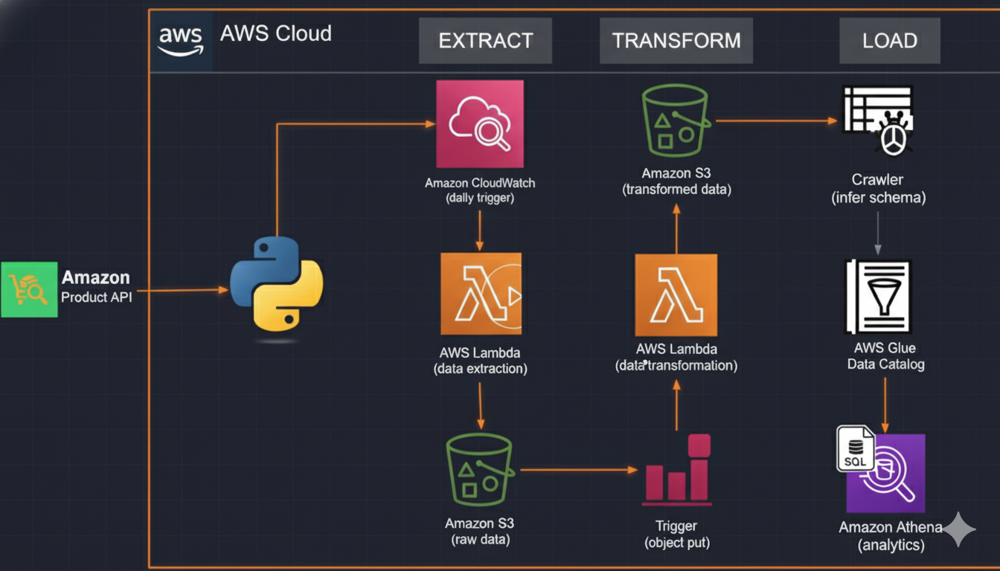

# 🛠️ Serverless Amazon Product Data ETL Pipeline on AWS

This repository contains the source code and documentation for a **fully automated, serverless ETL (Extract, Transform, Load) pipeline** built on **Amazon Web Services (AWS)**.  
The project extracts **real-time Amazon product data**, transforms it into a clean, analytics-ready format, and makes it available for **SQL-based analysis** using **Amazon Athena**.

---

## 🧭 Architecture Diagram



This ETL pipeline follows a classic **Extract–Transform–Load** design pattern using **AWS serverless services**, ensuring scalability, automation, and cost efficiency.

### **1️⃣ EXTRACT**
- **Amazon CloudWatch (Trigger)**  
  - A CloudWatch Event rule is scheduled to **trigger the extraction** process automatically (e.g., daily).  
- **AWS Lambda (Data Extraction)**  
  - The Lambda function (Python-based) makes an API call to the **Real-Time Amazon Data API** to fetch product data.  
- **Amazon S3 (Raw Data Storage)**  
  - The Lambda function stores the raw JSON response in an S3 bucket under:  
    ```
    s3://<your-bucket-name>/raw_data/to_process/
    ```

---

### **2️⃣ TRANSFORM**
- **S3 Object Put (Trigger)**  
  - S3 sends an event notification when a new object is uploaded to `raw_data/to_process/`.  
- **AWS Lambda (Data Transformation)**  
  - This second Lambda function reads the raw JSON, cleans and normalizes the data  
    (handling nulls, removing special characters, and structuring it into CSV).  
- **Amazon S3 (Transformed Data Storage)**  
  - The processed CSV is stored at:  
    ```
    s3://<your-bucket-name>/transformed_data/products/
    ```

---

### **3️⃣ LOAD & ANALYZE**
- **AWS Glue Crawler**  
  - Automatically scans `transformed_data/`, infers schema, and updates the **AWS Glue Data Catalog**.  
- **AWS Glue Data Catalog**  
  - Acts as a central **metadata store** for schema information.  
- **Amazon Athena**  
  - Enables you to query the CSV files in S3 directly using **standard SQL** for analytics and BI.

---

## ⚙️ Technologies Used

| Category | Technology |
|-----------|-------------|
| **Data Source** | Real-Time Amazon Data API (via RapidAPI) |
| **Cloud Platform** | Amazon Web Services (AWS) |
| **Compute** | AWS Lambda |
| **Storage** | Amazon S3 |
| **Orchestration** | CloudWatch Events, S3 Triggers |
| **Data Cataloging** | AWS Glue |
| **Analytics** | Amazon Athena |
| **Language** | Python 3 |

## 🧠 Challenges & Key Learnings

| Challenge | Solution |
|------------|-----------|
| **Lambda Timeouts** | Increased function timeout to accommodate API latency. |
| **IAM Permission Errors** | Ensured Lambda roles explicitly allow access to the target S3 bucket. |
| **CSV Parsing Issues** | Cleaned product titles by replacing hidden newline characters using `.replace('\\n', ' ')`. |

---

## 📈 Future Enhancements
- Add **AWS Step Functions** for improved orchestration.
- Integrate **Amazon QuickSight** for visual analytics.
- Implement **error notification via SNS** for failed Lambda executions.

---

## 👨‍💻 Author
**Darshil Shah**  
Data Engineer | AWS & Python Enthusiast  
[LinkedIn](https://www.linkedin.com/in/darshil-shah-38a780a8) • [GitHub](https://github.com/darshil1995)
